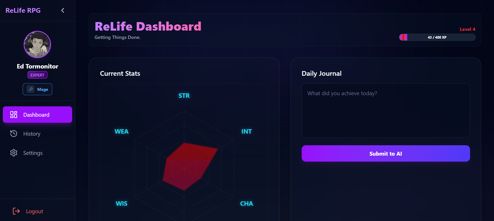

# ReLife RPG (Prototype-7)

ReLife RPG is a gamified life-tracking application that transforms your daily activities, achievements, and past history into RPG statistics. By logging your daily progress, the integrated **Google Gemini AI** analyzes your entries and awards you experience points (XP) and stat increases across six core attributes: **Strength (STR)**, **Intelligence (INT)**, **Charisma (CHA)**, **Creativity (CRE)**, **Wisdom (WIS)**, and **Wealth (WEA)**.



## 🚀 Key Features

### 📖 The Origin Story
Start your journey by telling the AI about your past life, struggles, and triumphs. The AI will analyze your story and generate your **Initial Stats** and recommend a starting **Character Class**.

### 🤖 AI-Powered Daily Journaling
Log your daily activities in the Dashboard Journal. The Gemini AI evaluates your actions (e.g., "Went to the gym" -> +STR, "Read a book" -> +INT) and dynamically updates your stats. Positive actions grant stat boosts and XP, while negative habits may penalize you!

### 📊 Hexagon Stat Visualization
Visualize your personal growth in real-time with an interactive Radar Chart showing your balance across the 6 key attributes.

### ⚔️ Gamified Progression & Customization
- **Leveling System**: Gain XP from daily actions to level up.
- **Skill Points**: Earn skill points upon leveling up to manually upgrade stats of your choice.
- **Titles & Classes**: Unlock and equip unique **Titles** (e.g., "Novice", "Scholar") and **Character Classes** based on your progression.
- **Profile Customization**: Update your avatar with an integrated image cropper and personalize your username.

### 🛡️ Security & Settings
- **Secure Authentication**: Email/Password and Google OAuth powered by Supabase.
- **Session Management**: Set auto-logout inactivity timeouts to protect your account.
- **Account Controls**: Full control over your data with options to reset your RPG progress or permanently delete your account.
- **Password Recovery**: Integrated Forgot/Reset password flows.

## 🛠️ Tech Stack

### Frontend Architecture
*   **Framework**: [React 19](https://react.dev/) with [Vite](https://vitejs.dev/)
*   **Language**: [TypeScript](https://www.typescriptlang.org/)
*   **Styling**: [Tailwind CSS v4](https://tailwindcss.com/)
*   **Charts**: [Recharts](https://recharts.org/) for the Hexagon Stat system
*   **Icons & Animations**: [Lucide React](https://lucide.dev/), [Framer Motion](https://www.framer.com/motion/), [React Confetti](https://www.npmjs.com/package/react-confetti)
*   **Routing**: [React Router v7](https://reactrouter.com/)

### Backend & Infrastructure
*   **Database & Auth**: [Supabase](https://supabase.com/) (PostgreSQL)
*   **Serverless Computing**: Supabase Edge Functions (Deno)
*   **AI Engine**: [Google Gemini API](https://ai.google.dev/) (`gemini-2.5-flash`)

## 📦 Installation & Setup

1.  **Clone the repository**
    ```bash
    git clone https://github.com/your-username/prototype-7.git
    cd prototype-7
    ```

2.  **Install dependencies**
    ```bash
    npm install
    ```

3.  **Environment Configuration**
    Create a `.env` file in the root directory and add your Supabase and Gemini credentials:
    ```env
    VITE_SUPABASE_URL=your_supabase_url
    VITE_SUPABASE_ANON_KEY=your_supabase_anon_key
    VITE_GEMINI_API_KEY=your_gemini_api_key
    ```
    *(Note: For Supabase Edge Functions, ensure `GEMINI_API_KEY` is set in your Supabase project's secrets.)*

4.  **Run the development server**
    ```bash
    npm run dev
    ```

## 📂 Project Structure

```text
prototype-7/
├── src/
│   ├── assets/       # Static assets and images
│   ├── components/   # Reusable UI (Modals, Sidebar, HexagonChart, etc.)
│   ├── lib/          # Core utilities
│   │   ├── audio.ts  # Audio effects manager
│   │   ├── db.ts     # Supabase DB operations and typings
│   │   ├── gemini.ts # AI Edge Function caller
│   │   └── supabase.ts # Supabase client initialization
│   ├── pages/        # Application routes (Dashboard, OriginStory, Settings, etc.)
│   ├── App.tsx       # Main layout and router provider
│   └── index.css     # Global styles and Tailwind base
├── supabase/
│   └── functions/    # Edge functions
│       └── gemini-ai/ # Deno function handling Gemini API logic
└── package.json
```

## 🎮 How It Works (User Flow)

1.  **Sign Up / Log In**: Create an account via email or Google.
2.  **Origin Story**: If you are a new user, you must narrate your background. The AI analyzes this and initializes your base stats.
3.  **Dashboard**: You arrive at your command center. Check your current Level, XP, and Stat Distribution.
4.  **Daily Journal**: Enter your daily achievements. The Gemini AI evaluates them, granting XP and boosting specific stats.
5.  **Level Up**: Gain enough XP to level up, triggering a celebration! Use your earned Skill Points to manually refine your build.
6.  **Customize**: Open the Sidebar to equip new Classes, change Titles, or update your profile picture.

## 📜 License

This project is licensed under the MIT License.
